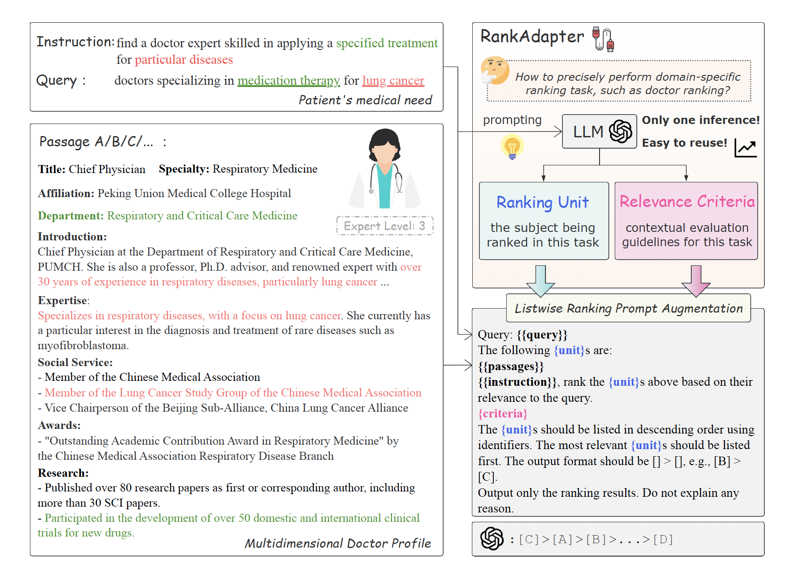

# RankAdapter

Code for paper "[LLM-based Expertise-driven Doctor Recommendation via Adaptive Prompt](https://www.google.com/)"

Adapting to diverse ranking tasks without fine-tuning

## Overview



~~对于listwise等llm based排序，在初始化类的时候我们也需要支持一个参数选择prompt语言，这样就可以和adapter一起使用, 我们把lang作为全局参数传入，用两次~~


### DrRank Dataset

这里放一张数据集分布图。说一下label的标注标准。

## Quick Start

~~介绍如何配置自己的数据集（通过超参数指定）参考：rankgpt quick example~~ 
~~类似于sun weiwei的数据集格式，我们期望用户提供jsonl类型的格式，我们提供脚本来进行jsonl_to_trec的转换，降低使用门槛，步骤需要在quick start中说明~~

我们的另外一个重点是对于rankadapter生成的排序unit和criteria进行展示

介绍一下LLMClient文件，并且说明如何增加对于新的大模型后端的支持。


## Reproducibility

```bash
bash scripts/run_experiments.sh
```


## Cite

If you find this repository helpful, feel free to cite our paper:
```latex
@article{Sun2023IsCG,
  title={Is ChatGPT Good at Search? Investigating Large Language Models as Re-Ranking Agent},
  author={Weiwei Sun and Lingyong Yan and Xinyu Ma and Pengjie Ren and Dawei Yin and Zhaochun Ren},
  journal={ArXiv},
  year={2023},
  volume={abs/2304.09542}
}
```


# 旧的实验设定

###
在所有模型的pointwise和setwise实验中，temp都设置的0，并且都使用字母进行passage编码。但是在生成criteria的时候，temp设置的是0.8
在所有模型的listwise实验中，temp都设置的0.8，并且都使用字母进行passage编码.

###
原始的实验中，system prompt在listwise和pointwise中使用的是英文版的：You are RankGPT, an intelligent assistant that can rank passages based on their relevancy to the query.

而在setwise中使用的是英文版的，和新实验相同的prompt：You are an intelligent assistant specialized in information retrieval, equipped with powerful text analysis and logical reasoning capabilities 
这个prompt也是新老实验的rank adapter都使用的prompt。

drrank数据集使用的instruction是中文还是英文版的已经无从考证，不过大概率是中文的，英文版是后面翻译加上去的。