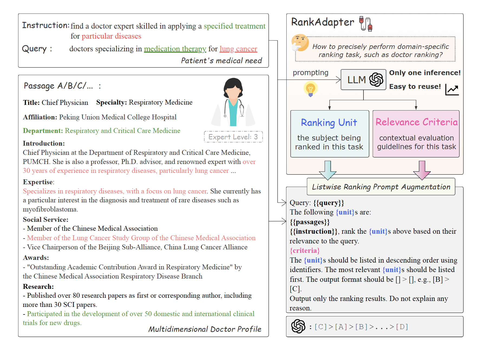

# DrRec-LLM

Code for the paper "[LLM-based Expertise-driven Doctor Recommendation via Adaptive Prompt](https://www.google.com/)"

## Overview

In online medical services, patients often search for doctors based on expertise, but existing systems typically prioritize doctors with high click-through or sales rates, often overlooking specialized expertise. This can result in recommendations that are not optimal for patients' specific needs. Our work addresses this by reframing the problem as a ranking task and introducing a novel LLM-based ranking framework. 

**RankAdapter** is the core contribution of this project, designed to provide adaptive prompt-tuning capabilities for LLMs, thereby enhancing ranking effectiveness. It consists of two main components that drive its adaptive mechanism:

- **Ranking Unit Adaptation**: This component dynamically adjusts the ranking unit (e.g., from “passage” to “doctor”) based on the specific domain, ensuring the model accurately focuses on the professional attributes of doctors.
  
- **Relevance Criteria Generation**: This component generates query-specific relevance criteria, such as experience in specific treatments or contributions to research. This context-driven criteria generation guides the ranking process, making it more aligned with actual patient needs.

RankAdapter integrates seamlessly with different ranking strategies (`pointwise`, `setwise`, and `listwise`) and significantly boosts LLM-based ranking performance in the medical domain without requiring additional training.



## DrRank Dataset

**DrRank** is our self-constructed dataset that focuses on ranking doctors based on their expertise in various medical fields, covering multiple diseases and treatments. It includes rich details about doctors, such as educational background, research achievements, awards, and expertise areas. 

## Quick Start

Install dependencies:

   ```bash
   pip install -r requirements.txt
   ```

Below is an example code snippet demonstrating how to apply RankAdapter to enhance an LLM-based ranker:
```python
from ranker.llm_ranker import ListwiseLlmRanker
from utils.rank_adapter import RankAdapter

# Initialize RankAdapter
adapter = RankAdapter(model_name="gpt-4", mode="listwise", language="en")

# Initialize Listwise ranker with RankAdapter
ranker = ListwiseLlmRanker(model_name="gpt-4", adapter=adapter)

# Perform ranking
query = "Find an expert surgeon for lung cancer treatment"
documents = ["Doctor A's profile...", "Doctor B's profile..."]
results = ranker.rerank(query, documents)
print(results)
```

## Reproducibility

```bash
bash scripts/run_experiments.sh
```


Experimental results demonstrate that RankAdapter significantly improves various LLM-based rankers on the DrRank dataset, achieving over 11% improvement in nDCG@10.

# Cite
_to be updated_